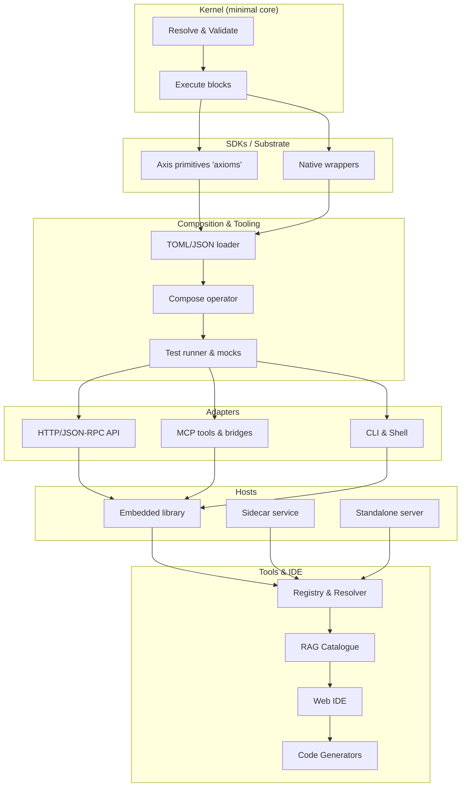
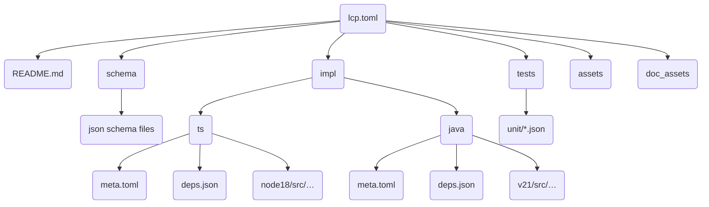

# LCOD Ecosystem Overview

This document provides an overview of the **LCOD** (Low‑Code On Demand) ecosystem. It is intended as a human‑readable and machine‑parsable specification for designing, cataloguing, and composing low‑code components and applications. The goal of LCOD is to enable developers and AI assistants to build full‑stack solutions by assembling reusable blocks rather than writing bespoke code, while still allowing native code generation and compilation when needed. The format is designed to stay portable across runtimes, IDEs and organisations.

## 1. Concept and Vision

LCOD reimagines low‑code tooling as a **hierarchy of composable blocks**. Each block encapsulates a self‑contained function or UI element with clearly defined inputs, outputs, dependencies and documentation. Blocks can be primitives (axioms), contracts with multiple implementations, flow operators with slots, or composites built from other blocks. A lightweight **kernel** resolves, validates and executes these blocks. An ecosystem of tools around the kernel provides design‑time assistance, distribution, packaging, and integration.

Key ideas:

- Design‑time vs. runtime separation – A large language model (LLM) and retrieval augmented generation (RAG) assist only during the design phase (searching for blocks, composing them, filling in parameters). At runtime, the application executes natively without incurring LLM token costs.
- Minimal kernel – A core runtime library that understands a small DSL for composition and delegation. It can call native functions, run composite flows, and defer to platform‑specific SDKs. Everything else (HTTP servers, CLIs, code generators) is layered on top.
- Standardized packaging – Each block lives in its own directory (component package) with a canonical descriptor file (`lcp.toml`), schemas, documentation, implementation variants and tests. Blocks are referenced via canonical URIs (`lcod://namespace/name@version`) and can be fetched from Git, HTTP or local mirrors.
- Flexible resolution – A resolver supports mirror and replacement rules to fetch blocks from different sources (company registry, forks, offline cache) and can produce a lockfile for reproducibility. The resolver itself can be expressed as an LCOD composite, running on top of different kernels via a shared axiom set.
- Agent‑assisted IDE – A graphical IDE allows humans to drag and drop blocks in a tree/flow view, while an AI assistant suggests next blocks and fills in parameters by querying the RAG index. Generated code or binaries are produced on demand.

## 2. Layered Architecture

LCOD is designed like an onion, with a minimal core and optional layers built on top. The following mermaid diagram illustrates the layers:



**N0 (Kernel)** — provides only the ability to resolve a block by its ID, validate inputs/outputs against JSON Schemas, and execute it by delegating to either primitive `axiom` functions, `native` implementations, or composite flows defined via the compose operator. It defines the `Func` and `Registry` interfaces and is free of any I/O or networking concerns.

**N1 (SDKs)** — language‑specific substrates supply primitive functions (axioms) such as `http.get`, `fs.read`, `time.now`, etc. They also allow registering native implementations of blocks when available (e.g., a Java service for `parse_city`). These SDKs handle details like asynchronous execution, concurrency, and platform‑specific dependencies. Each substrate may ship a different axiom library, while sharing the same high-level contracts.

**N2 (Composition & tooling)** — builds on the kernel to load block descriptors (`lcp.toml`), interpret the `compose` operator with slots, map inputs and outputs, bind contracts to implementations, run declarative tests with mocks and hints (timeout, retry, idempotence) and produce runtime metadata (traces, logs).

**N3 (Adapters)** — optional modules that expose blocks through external interfaces such as HTTP (Express for Node, Spring Boot for Java), JSON‑RPC/MCP, CLIs or message queues. They translate between the kernel’s call semantics and the chosen transport.

**N4 (Hosts)** — ways to run the kernel: embedded as a library in an existing program, as a sidecar process accessible via JSON‑RPC, or packaged as a standalone server. Hosts handle dependency injection, configuration and resource limits (timeouts, memory).

**N5 (Tools & IDE)** — higher‑level tools for humans and AI agents: a registry to store block packages, a resolver to fetch them with mirror/replacement rules, a RAG index for semantic search, a graphical IDE for composing blocks with a tree/flow view and property inspector, and code generators to produce native code for various languages and frameworks. Different IDEs can target citizen developers or expert engineers, all consuming the same LCOD catalogue.

## 3. Component Package Format (LCP)

Each LCOD block is packaged in a directory with a canonical descriptor file (`lcp.toml`) describing its identity, inputs, outputs, dependencies and documentation. The package may also contain JSON schemas, documentation, implementation variants and tests. The folder can be fetched from Git, HTTP or local file systems. The canonical path of a block is expressed as a URI:

```
lcod://<namespace>/<name>@<version>
```

For example `lcod://core/http_get@1.0.0` identifies version 1.0.0 of the `http_get` block in the `core` namespace.

An example `lcp.toml` is shown below:

```toml
schemaVersion = "1.0"
id = "lcod://core/http_get@1.0.0"
name = "http_get"
namespace = "core"
version = "1.0.0"
kind = "function"          # function | axiom | ui | workflow
summary = "HTTP GET primitive."

[tool]  # MCP‑like call signature
name = "http_get"
description = "Perform an HTTP GET request."
inputSchema = "schema/http_get.in.json"
outputSchema = "schema/http_get.out.json"

[hints]  # optional runtime hints
timeoutMs = 5000
retries = 0
idempotent = true
pure = false

[deps]  # other blocks this block depends on (composite only)
requires = []

[docs]
readme = "README.md"
logo = "logo.svg"

[implMatrix]  # available implementation variants
languages = ["ts", "java"]

[ui]  # optional UI metadata
kind = "react"  # react | svelte | vue | webcomponent
propsSchema = "schema/props.json"
slots = ["header", "content", "footer"]
```

The directory structure of a typical block looks like this:



Explanation:

- `lcp.toml` – canonical descriptor (TOML). It should be the only descriptor file in the package.
- `README.md` – long description, usage examples and additional notes. Agents can parse this for context.
- `schema/` – JSON Schemas referenced by `inputSchema`, `outputSchema`, and optional `propsSchema` for UI blocks.
- `impl/<lang>/` – implementation variants. Each contains:
  - `meta.toml` – metadata about targets (e.g. Node versions, JDK versions) and build hints.
  - `deps.json` – language‑agnostic list of runtime and test dependencies. Assemblers translate this into `package.json`, `pom.xml`, `Cargo.toml`, etc.
  - Subfolders by target (e.g. `node18/`, `browser/`, `v21/`) containing actual source code.
- `tests/` – declarative unit tests (`unit/*.json`) with inputs, expected outputs, and axiom mocks. These tests run identically across languages.
- `assets/` – runtime assets used by the block (icons, templates).
- `doc_assets/` – images and diagrams used in documentation.

When non‑standard file names are used, they must be listed in an optional `index.json` so that resolvers know how to find them.

## 4. Composition DSL

Composite blocks specify their internal flow using a simple DSL expressed in YAML under `compose.yaml`. The kernel interprets this DSL at runtime. The DSL supports:
- Contract calls: `call: "lcod://contract/<domain>/<name>@<version>"`
- Named slots: a default `children` slot when a block has a single child list, and multi‑slot objects (e.g., `{ then: [...], else: [...] }`).
- Scopes and references: `$` (run state/out aliases), `$slot.*` (slot‑injected vars like `item/index`), `$env`, `$globals`, `$run`.
- Flow blocks: if/then/else, foreach (array or stream), parallel, try/catch/finally, throw, with hints for retry/timeout and memory retention.

Kernel SDK for custom components

- Custom flow/logic components can invoke their children via a stable API (planned): `ctx.runChildren()` and `ctx.runSlot(name, localState, slotVars)`. The compose runner passes slots in meta so that implementations can orchestrate nested flows without hard‑coded handling in the runner. This keeps flow operators versioned like any other component while enabling palette integration (icons, docs, evolution).

Example composition for a `my_weather` block:

```yaml
compose:
  - call: lcod://contract/location/get@1
    in: {}
    out:
      gps: gps
  - call: lcod://contract/location/extract-city@1
    in:
      gps: $.gps
    out:
      city: city
  - call: lcod://contract/net/http-client@1
    in:
      url: https://weather.example?city=$.city
    out:
      body: raw
  - call: lcod://contract/json/parse@1
    in:
      raw: $.raw
    out:
      tempC: tempC
```

This declares a sequence of three calls:

1. Call `localisation` with no input; expose the result’s `gps` field.
2. Call `extract_city` using the `gps` field from the previous result (`$.gps`), exposing a `city` field.
3. Call `weather` using the `city` field, exposing the final `tempC` output.

Bindings are explicit: each `in` entry maps parameter names to literal values or paths in the accumulated local state (paths are indicated with `$.field`). Each `out` entry picks specific fields from the child output and exposes them under new names. There is no hidden state; all data flow is explicit and deterministic.

Flow blocks with slots are expressed like:

```yaml
call: lcod://flow/if@1
in:
  cond: $.ok
children:
  then:
    - call: …
  else:
    - call: …
```

And a foreach with collection:

```yaml
call: lcod://flow/foreach@1
in:
  list: $.chars
children:
  body:
    - call: lcod://contract/string/char-code@1
      in:
        ch: $slot.item
      out:
        code: code
collectPath: $.code
out:
  results: codes
```

### Embedded scripting (planned)

Some use cases require lightweight algorithms beyond declarative wiring. LCOD plans to embed a sandboxed JavaScript subset so that components can execute concise logic while remaining portable across kernels (Node, Rust via QuickJS, Java via Graal, etc.). Example:

```js
let status = 'none';
if ($in.type === 'google') {
  status = await $api.run('sendGmail', { ...$in, msg: `Special for you: ${$in.msg}` });
} else {
  status = $api.global('sorryMessage');
}
return { status };
```

Scripts interact with the host via `$api` (call other components, read configuration) and receive sandboxed inputs (`$in`, `$slot`, `$state`). They complement axioms without inflating declarative flows.

Tests accompany composite blocks to verify flows. A test might look like:

```json
{
  "name": "happy_path",
  "input": { "city": "Paris" },
  "mocks": { "http_get": { "status": 200, "body": "{\"tempC\": 21}" } },
  "expect": { "tempC": 21 }
}
```

## 5. Registry and Resolution

Blocks are referenced by canonical IDs like `lcod://<namespace>/<name>@<version>`. A **resolver** can fetch the corresponding package from:

- A Git repository (branch/tag/commit)
- An HTTP server (tarball or `.lcpkg` archive)
- A local directory (for development)

The resolver applies mirror and replacement rules and can produce a `lcp.lock` file to pin exact versions and sources for reproducible builds.

## 6. Implementation Variants and Kernel Execution

Blocks come in three types:

1. Axiom – primitive functions built into the SDK (e.g. `http_get`, `parse_json`, `gps_read`). They are provided by the substrate and are not implemented in the component.
2. Native – blocks that already have an implementation in the target language (e.g. a Java method, a Rust function). The `impl/<lang>/` folder supplies source code for these.
3. Composite – blocks whose behaviour is defined via the `compose` DSL. The kernel executes children, maps inputs and outputs, and merges the results.

All blocks carry input and output schemas that the kernel validates at runtime. If the implementation does not exist for a native block, a generator can synthesize a wrapper that calls the children via the kernel’s context API:

```ts
export const weather: Func = async (ctx, input) => {
  const { body, status } = await ctx.call("http_get", { url: `https://weather.com?city=${input.city}` });
  if (status !== 200) throw new Error("Failed to fetch weather");
  const { tempC } = await ctx.call("parse_json", { raw: body });
  return { tempC };
};
```

The kernel supports concurrency and resource management based on hints (timeouts, retries, idempotence). For example, parallel execution of independent children is possible when no data dependency exists.

## 7. Design‑Time Assistance with RAG & AI Collaboration

An LLM can help designers search and assemble blocks at design time. To do so it queries a **RAG index** built from the registry:

1. Index – All descriptors, documentation and schemas are chunked and embedded into a vector database (e.g. pgvector). Each entry stores the block ID, summary, keywords, field names, and other metadata.
2. Search – The IDE’s palette includes a semantic search bar. When the user types “login card with Google and Microsoft OAuth”, the RAG returns candidate blocks with scores (e.g. `ui.login_card`, `service.oauth_google`, `service.oauth_microsoft`).
3. Insertion – The LLM suggests a composition and fills in the `props` for the UI block and the `in` mappings for children. It can also create new blocks by following the spec and tests.
4. Validation – The kernel’s schema validation and tests ensure that the proposed composition is correct. Errors and hints are returned to the LLM for self‑correction.

LLMs do not need to be trained specifically on LCOD; prompts and catalogue traversal tools are enough to reason over component descriptors. This enables private/on-premise models to assemble solutions using only metadata and schema information.

## 8. IDE and Graphical Editor

An IDE built on LCOD presents two synchronized views: a **tree view** showing the hierarchical slots/children and a **flow view** showing the data/trigger graph. A palette lists available blocks (filtered by compatibility) and can search with RAG. An inspector panel displays the editable properties of the selected block, generated from its input schema and hints. When a UI block implements `[ui]`, the IDE can render a live preview using the provided preview component and props schema. The IDE persists the project descriptor (`lcp.toml` + `compose.yaml`) and generates code on demand. Multiple IDEs can coexist (technical, citizen, mobile), all interoperable thanks to the shared format.

## 9. Distribution and Extensibility

LCOD supports packaging flows as libraries for different languages, as full applications or as microservices. The resolver and kernel allow replacing blocks with internal versions (for enterprise use), mirroring registries and verifying integrity. Blocks can declare UI metadata (`[ui]`) and events (AsyncAPI/CloudEvents) for reactive architectures. Additional layers (HTTP, gRPC, GraphQL, CLI) can be built as adapters without modifying the core. Future extensions might include support for WebAssembly for sandboxed execution, type guards for generics, and multi‑agent coordination.

## 10. Repository Organization

A recommended polyrepo layout for the LCOD ecosystem:

| Repository       | Purpose                                      |
| ---------------- | -------------------------------------------- |
| `lcod-spec`      | Specification, schemas, docs and shared test fixtures (`tests/spec`). |
| `lcod-kernel-js` | JavaScript/TypeScript kernel + SDK implementation. |
| `lcod-registry`  | Git registry of LCP components.              |
| `lcod-resolver`  | CLI and library to resolve and cache blocks. |
| `lcod-adapters`  | HTTP/JSON‑RPC/MCP adapters (optional).       |
| `lcod-ide`       | Graphical IDE (future work).                 |

It is useful to place a high‑level overview like this document in the root of the organization (e.g. `lcod-team/README.md`) so that contributors and agents have immediate context. More detailed specs and API references can reside in `lcod-spec/docs/`.

### Shared Spec Fixtures

Portable conformance tests live under `lcod-spec/tests/spec`. Each fixture is an LCOD compose packaged as a test harness via `tooling/test_checker@1`. Kernels can execute the entire suite with the standard runners (`npm run test:spec` on Node, `cargo run --bin test_specs` on Rust). When adding new fixtures, reference them from the roadmap and ensure every kernel consumes them through the shared runners. This keeps substrates lightweight while centralising behavioural coverage in the specification repository.

## 11. Conclusion

LCOD aims to provide a solid foundation for low‑code development with AI‑assisted design and native‑quality runtime. By standardizing the structure of components (`lcp.toml`), enforcing explicit dataflow (`compose`), and keeping the kernel minimal, it allows developers to mix and match reusable blocks across languages and platforms. A resolver abstracts the source of blocks and ensures reproducibility. A registry and RAG index make discovery and reuse practical. Together, these pieces enable a scalable ecosystem where humans and AI collaborate to build robust applications efficiently.
