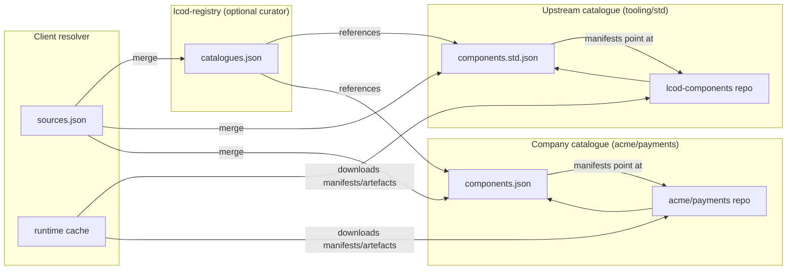

# LCOD Registry Architecture (Federated)

> **Status — Transitioning to JSONL manifests**
>
> The registry is moving to the streaming JSONL list format described in
> [`docs/resolver/manifest-lists.md`](resolver/manifest-lists.md).  The sections below
> reflect the legacy catalogue layout.  During the transition, producers should export the
> new JSONL manifests in parallel; consumers will prefer JSONL when available.

This document describes the **federated registry** model used to publish and consume LCOD
components. The goal is to keep registries light, composable and verifiable, so that any
organisation can expose its own catalogue without relying on a central server.

## 1. Design Principles

- **Pointer-first** – registries publish *references* to immutable manifests hosted in the
  original repository. They do not mirror component files.
- **Git-friendly** – a registry can be a plain Git repo (or any static HTTP host). Releasing a
  component is a commit or pull request, not a bespoke API call.
- **Composable sources** – clients merge several registries (official, company-specific,
  project-specific). The lookup order is explicit in the resolver configuration.
- **Verifiable** – every catalogue entry carries the information needed to check provenance:
  repository URL, commit SHA and optional integrity metadata. Signature support will return
  once the JSONL format settles; today we rely on transport security plus checksums.
- **Opt-in aggregation** – an “official” registry may curate a list of other catalogues, but
  each catalogue remains autonomous. Removing the aggregator does not break consumers who
  reference catalogues directly.

## 2. Repository Layout

A registry repository is intentionally small:

```
catalogues.json                 # list of external catalogues (optional)
keys/<namespace>/<owner>.pem    # trusted public keys (optional)
README.md / docs/               # human documentation
```

Registries no longer duplicate `packages/<namespace>/<name>` folders. Instead, they point at
catalogues maintained by upstream projects.



### 2.1 `catalogues.json`

This file lists the catalogues curated by the registry. Each entry tells the resolver where
to fetch the catalogue, how to authenticate it, and how it should be merged locally.

```json
{
  "schema": "lcod-registry/catalogues@1",
  "catalogues": [
    {
      "id": "tooling/std",
      "description": "Standard tooling components maintained by the LCOD team",
      "url": "https://raw.githubusercontent.com/lcod-team/lcod-components/main/registry/components.std.json",
      "kind": "git",
      "commit": "4a569e82930c784d2b4f2a40a39e85daea774a80",
      "publicKey": "keys/tooling/lcod-team.pem"
    },
    {
      "id": "acme/payments",
      "description": "Acme Corp payment building blocks",
      "url": "https://git.acme.com/platform/payments/registry/components.json",
      "kind": "https",
      "checksum": "sha256-…"
    }
  ]
}
```

> **Note**: `priority` remains part of the legacy `sources.json` format so
> down-level resolvers can decide merge order. JSONL manifests rely purely on
> list ordering, so recent tooling ignores the field once catalogues are
> converted.

- `kind` indicates how the resolver should interpret `url` (`git`, `https`, `file`).
- `commit` or `checksum` pins the catalogue to an immutable revision.
- `publicKey` is a legacy field carried by some catalogues. Signature
  verification is currently disabled; consumers should rely on transport-level
  trust until signature support returns.
- Catalogue precedence follows the order in which lists are consumed; lower identifiers are not
  treated specially.

A registry may publish `catalogues.json` at the repository root or rely on documentation only.
Consumers can also ignore it entirely and point directly to the catalogues they trust.

## 3. Catalogue Format

A catalogue is a JSON document maintained by the component author. It enumerates the versions
exposed by the catalogue and provides enough metadata for the resolver to fetch manifests.

```json
{
  "schema": "lcod-registry/catalogue@1",
  "id": "tooling/std",
  "origin": {
    "type": "git",
    "url": "https://github.com/lcod-team/lcod-components",
    "commit": "4a569e82930c784d2b4f2a40a39e85daea774a80"
  },
  "components": [
    {
      "id": "lcod://tooling/array/append",
      "versions": [
        {
          "version": "0.1.0",
          "manifest": "packages/std/components/tooling/array.append/0.1.0/manifest.json",
          "sha256": "sha256-…"
        }
      ]
    },
    {
      "id": "lcod://tooling/registry_catalog/collect",
      "versions": [
        {
          "version": "0.1.0",
          "manifest": "packages/std/components/tooling/registry_catalog.collect/0.1.0/manifest.json"
        }
      ]
    }
  ]
}
```

Notes:

- `manifest` is a relative path or URL pointing at the component manifest (see section 4).
- `sha256` is optional but recommended. It lets consumers detect tampering even when manifests
  live in a mutable branch.
- A catalogue can include additional metadata (documentation links, tags, compatibility
  matrices). Kernels ignore unknown fields.

Catalogues may be split per namespace or per product. There is no global naming rule beyond
ensuring the `id` is unique for the publisher.

## 4. Component Manifest

The manifest format itself is unchanged from the monolithic model.

```json
{
  "schema": "lcod-registry/manifest@1",
  "id": "lcod://tooling/array/append@0.1.0",
  "publishedAt": "2025-10-14T18:00:00Z",
  "source": {
    "type": "git",
    "url": "https://github.com/lcod-team/lcod-components",
    "commit": "4a569e82930c784d2b4f2a40a39e85daea774a80",
    "path": "packages/std/components/tooling/array.append"
  },
  "files": [
    { "path": "lcp.toml", "sha256": "…", "size": 707 },
    { "path": "README.md", "sha256": "…", "size": 446 },
    { "path": "compose.yaml", "sha256": "…", "size": 399 }
  ],
  "dependencies": [],
  "artifact": null
}
```

Manifests remain the canonical, immutable description of a component version. They may live in
any Git repository as long as the catalogue points at them.

## 5. Resolver Configuration

Each runtime ships with a **local sources file** (`sources.json`). It lists the catalogues
trusted by default and pins their expected location/checksums. Users can edit or replace this
file at any time.

```json
{
  "schema": "lcod-resolver/sources@1",
  "sources": [
    {
      "id": "lcod-default",
      "priority": 50,
      "entrypoint": {
        "type": "https",
        "url": "https://raw.githubusercontent.com/lcod-team/lcod-registry/main/catalogues.json"
      },
      "checksum": "sha256-…",
      "publicKey": "keys/tooling/lcod-team.pem"
    },
    {
      "id": "acme-internal",
      "priority": 20,
      "entrypoint": {
        "type": "git",
        "url": "https://git.acme.com/platform/registry.git",
        "commit": "a79e…",
        "subpath": "catalogues.json"
      }
    }
  ]
}
```

At runtime the resolver:

1. Loads the local configuration (project overrides + user defaults).
2. Fetches each pointer in configuration order and expands it into individual catalogues.
3. Verifies optional checksums for each pointer (signature verification is temporarily
   disabled).
4. Fetches referenced catalogues (and their checksums when provided).
5. Merges component entries; the first match wins based on manifest order.
6. Resolves dependencies by downloading the referenced manifests and verifying hashes.

### Direct references

For one-off experiments, a compose may reference a component by Git URL instead of going
through a catalogue:

```yaml
compose:
  - call: lcod://tooling/script@1
    in:
      source: |
        async ({ imports }) => {
          return await imports.gitFetch({
            url: "https://github.com/acme/payments.git",
            commit: "a79e…",
            path: "registry/components.json"
          });
        }
```

This inline fetch is functionally equivalent to adding the catalogue to the resolver config,
just less ergonomic.

## 6. Migration Notes

- Existing registries that already populated `packages/…` and `packages.jsonl` may keep doing
  so temporarily. Kernels treat the federated format as **additive**: if a catalogue references
  a manifest inside the same repository, nothing changes.
- New registries should prefer the federated layout to avoid exponential growth and to
  preserve provenance.

## 7. Security Checklist

- Include checksums for pointer files. Signature support is currently
  suspended while the JSONL format settles.
- Keep a text log of catalogue revisions (Git commit history is enough).
- Validate `source.commit` in manifests when importing catalogues.
- Prefer immutable URLs (tagged releases, commit archives) over mutable branches.

With these safeguards a resolver can consume catalogues from multiple vendors while giving
operators full control over the trust chain.
