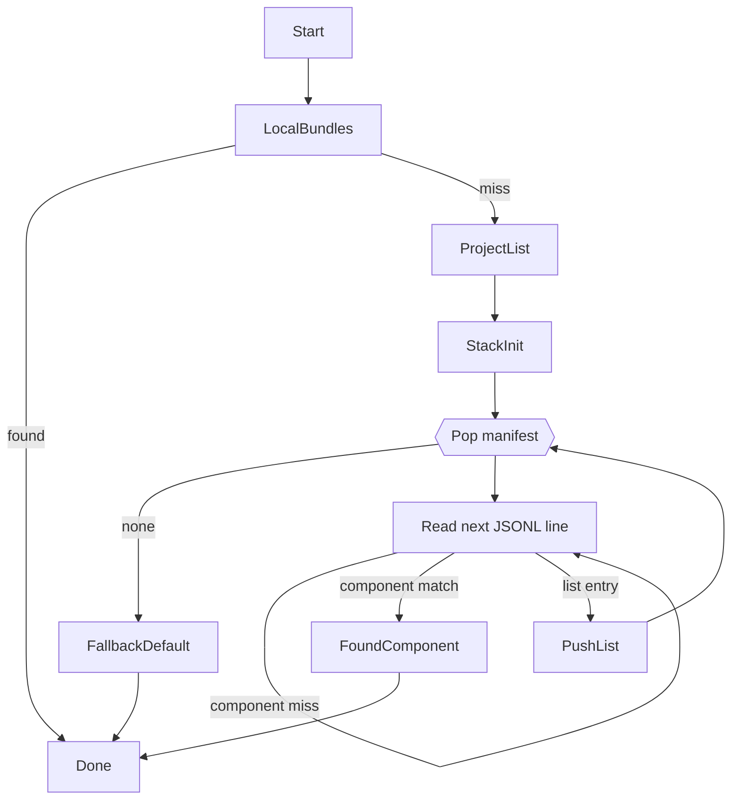

# JSONL Manifest Lists

This document captures the upcoming registry format used by the resolver and the
kernels.  The goal is to replace the legacy mix of `sources.json`, catalogue
bundles, and package manifests with **one streaming-friendly list format**.

## Guiding principles

- **Single format**: every catalogue is a [JSON Lines](https://jsonlines.org/)
  file.  Each line is an independent JSON object.  No schema juggling between
  `sources`, `catalogues`, or `index` files.
- **Streaming-first**: JSONL lets us read line-by-line (local file or HTTP
  response) without buffering everything.  The resolver can bail out as soon as
  all targets are resolved.
- **Composable lists**: a manifest can reference other manifests.  This mimics a
  `PATH`—linear search with optional jumps.  Kernels only need a stack and a
  "visited" set to avoid loops.
- **Deterministic ordering**: manifests are consumed in order.  The first entry
  that matches a requested component wins; metadata such as `namespace`,
  `package`, or `version` let the resolver skip entire lists quickly.

## File structure

The first line describes the file itself.  All other lines are independent
entries.  Empty lines and comments are not allowed.

```json
{"type":"manifest","schema":"lcod-manifest/list@1","description":"Primary sources"}
{"type":"component","id":"lcod://tooling/array/append@0.1.0","compose":"packages/std/components/tooling/array.append/compose.yaml","package":"lcod-components/std","version":"0.1.0"}
{"type":"list","path":"../registry/components.jsonl","package":"lcod-components/std"}
{"type":"list","url":"https://raw.githubusercontent.com/lcod-team/lcod-registry/main/catalogues.jsonl","namespace":"lcod://","version":">=0.1.0"}
```

### Fields

| Field        | Type     | Description                                                                           |
|--------------|----------|---------------------------------------------------------------------------------------|
| `type`       | string   | `manifest` (header), `component`, or `list`.                                          |
| `id`         | string   | Canonical component id (`lcod://…`) for `component` entries.                         |
| `compose`    | string   | Path to the component `compose.yaml` (relative for local manifests).                 |
| `lcp`        | string   | Optional path to the matching `lcp.toml` (defaults to `../component.lcp.toml`).      |
| `package`    | string   | Optional logical package (e.g. `lcod-components/std`).                               |
| `version`    | string   | Optional semver expression (exact, `^1.2.3`, `>=0.1.0`).                              |
| `namespace`  | string   | Optional id prefix; resolve skips the entry if the target id does not start with it. |
| `path`       | string   | Relative path to another manifest (when `type = "list"`).                            |
| `url`        | string   | Absolute URL to another manifest (exclusive with `path`).                            |

A loader is free to add extra metadata; kernels should ignore unknown fields.

## Resolution algorithm (KISS)

When a kernel resolves `lcod://package/component@version`, we chain small steps:

1. Check bundled workspaces (spec + resolver).  These are regular directories,
   so no manifest lookup is needed.
2. Enumerate manifests using `tooling/manifest/stream@0.1.0`.
3. Deduplicate manifests (by absolute path/URL) to avoid cycles.
4. Skip manifests when metadata proves they cannot contain the requested id
   (different namespace/package/version).
5. Yield the first matching component; caches and future lookups reuse the local
   compose path.



- `ProjectList` refers to `<project>/lcod.sources.jsonl` when present.
- `FallbackDefault` is typically `~/.lcod/sources.jsonl`; if absent we create one
  pointing to the public registry.
- `PushList` resolves relative paths against the current manifest location.
- For remote manifests we stream the HTTP response; no full download required.
- Search stops at the first matching component.  Ordering your manifest lists is
  the way to express precedence.

## Schemas

A dedicated JSON Schema (`schema/manifest-list.schema.json`) validates the
entries.  We keep it intentionally small:

- `manifest` header with required `schema` field.
- `component` entries require `id` and either `compose` or `url`.
- `list` entries require exactly one of `path` or `url`.
- Optional metadata (`package`, `namespace`, `version`) help with filtering.

See `docs/schemas.md` for integration guidance.

## Next steps

- Update `lcod-resolver` to expose `tooling/manifest/stream@0.1.0` and the
  `lcod://resolver/locate_component@0.1.0` compose using this format.
- Convert `lcod-components`, `lcod-registry`, and `lcod-rag` manifests to JSONL.
- Teach `lcod-cli` to bootstrap a user-level manifest at `~/.lcod/sources.jsonl`.
