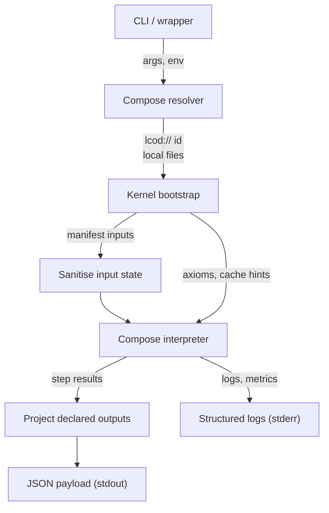

## Runtime Execution Pipeline

The three kernels (Rust, Node.js, Java) now follow the same high-level pipeline when executing a compose.  
This document captures the canonical flow so tooling and future frontends can rely on a shared mental model.

### Stage breakdown

1. **CLI / wrapper**  
   Parses user flags (`lcod run …` or direct binary invocations), resolves inline key/value arguments into JSON and ensures the proper runtime bundle is on `LCOD_HOME`.  
   The wrapper streams kernel logs to `stderr` and only forwards the final JSON object written to `stdout`.

2. **Compose resolver**  
   Accepts either filesystem paths, HTTP URLs, or `lcod://` identifiers.  
   Kernels first ask `lcod://resolver/locate_component@0.1.0`; if the registry does not have the component locally, they fall back to the catalogue (`components.std.jsonl`) and download both `compose.yaml` and `lcp.toml`.

3. **Kernel bootstrap**  
   Loads the runtime bundle, registers core/resolver/tooling contracts, prepares cache directories, and locates the manifest adjacent to the compose.  
   The manifest exposes declared `inputs` and `outputs`, which power the sanitiser and projector stages.

4. **Sanitise input state**  
   The initial scope handed to the interpreter only retains manifest inputs.  
   Missing keys are initialised to `null`, preventing upstream callers from leaking additional entries into the sub-component scope.

5. **Compose interpreter**  
   Executes steps sequentially with slot support, calling into registered tooling/contract implementations.  
   Nested invocations (`ctx.call`) now honour the declared outputs of each registered component, ensuring re-exported state never exceeds the contract.

6. **Project declared outputs**  
   Before returning control to the CLI, each kernel projects the final state onto the manifest outputs.  
   Callers receive a minimal JSON document with only the declared fields (`warnings`, `error`, `value`, …); everything else stays internal, mitigating accidental or malicious scope exfiltration.

7. **Result emission and logging**  
   The projected payload is printed as pretty JSON on `stdout`.  
   Diagnostic messages (resolver fallbacks, warnings, traces) continue to flow through `stderr`, so automation can safely consume the JSON response.

### Security considerations

- Output projection enforces component contracts (roadmap item **M2-07**) across all kernels.  
  Even if a compose tries to re-export temporary secrets from a nested component, the runner silently discards the extra fields.
- Combined with input sanitisation, the execution surface now mimics a black box: each compose receives exactly what it declared and returns only the schema it promised.

This alignment keeps the runtime behaviour predictable and prepares the ground for HTTP/JSON-RPC frontends that rely on identical semantics regardless of the underlying kernel.
