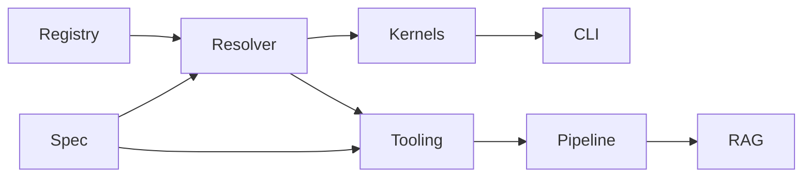

# LCOD v2 Exploration

This folder collects design sketches, diagrams, and notes for a v2 architecture focused on KISS principles.

## Goals
- Express compose logic naturally (minimal `out`/plumbing) while keeping traceability.
- Describe subsystems (run-compose, resolver, scope lookup, etc.) with Mermaid diagrams and drill-down sections.
- Iterate quickly without impacting current v1 behavior.

## Structure
- [`overview.md`](overview.md) – high-level modules diagram.
- [`high-level-approach.md`](high-level-approach.md) – top-down pipeline.
- [`internal-representation.md`](internal-representation.md) – meta + compose format.
- [`kernel-high-level.md`](kernel-high-level.md) – runtime primitives.
- [`scope-model.md`](scope-model.md) – closure rules for slots.
- [`structural-components.md`](structural-components.md) – layout/pipeline components.
- [`exceptions.md`](exceptions.md) – error handling contract.
- [`principes.md`](principes.md) – KISS principles.
- [`roadmap.md`](roadmap.md) – build order & branches.
- [`handles.md`](handles.md) – handle/trait model for native resources.
- `subsystems/` – per-area breakdown (resolver, runtime, tooling, etc.).

## Project matrix

| Subsystem / Command | Repository (branch `v2`) | Depends on |
| --- | --- | --- |
| Runtime (`runComponent`, kernels) | `lcod-kernel-rs`, `lcod-kernel-js`, `lcod-kernel-java` | Resolver artifacts, spec contracts (no CLI dependency) |
| Resolver (component lookup) | `lcod-resolver` | Spec (meta+compose), handles, RAG |
| Spec (contracts/components) | `lcod-spec` | -- |
| Tooling/Testkit | `lcod-spec` + `lcod-components` | Runtime & resolver APIs |
| Pipeline (extract/translate/assemble) | `lcod-spec` (`tooling/*`) | RAG bases, resolver |
| RAG (functions/components) | `lcod-components` (or dedicated repo) | Spec schema (meta+ast) |
| CLI/Host (`lcod run`) | `lcod-cli` | Kernels, resolver |
| Registry/catalog | `lcod-components` / future repo | Spec exports, resolver |

Kernels can run standalone (via their wrappers); the CLI simply hosts them when needed. Each kernel must embed the bundled spec + resolver in its lookup paths to bootstrap before honoring user/workspace/catalog lookups.

Dependencies (simplified):

Feel free to add new sketches; keep each file focused and reference diagrams from the overview for easy navigation.
