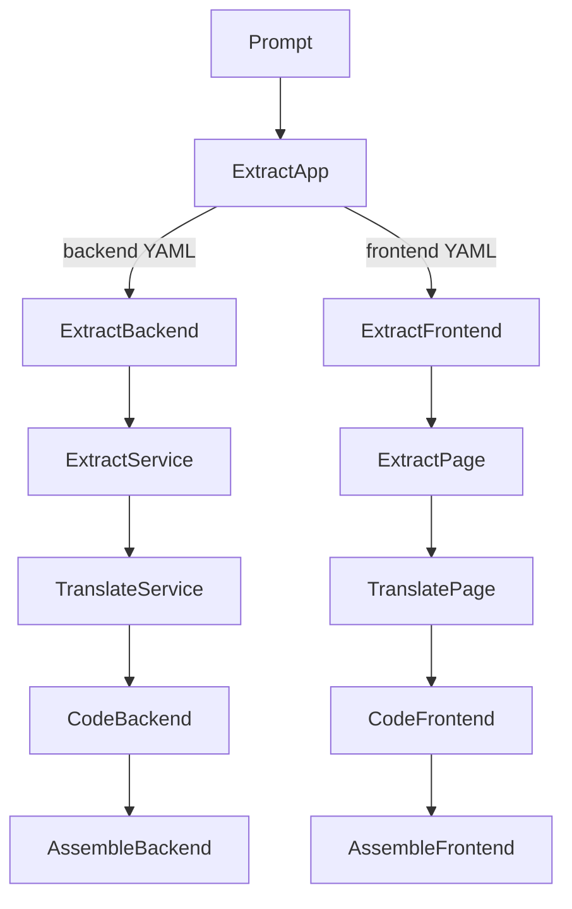

# High-level approach (LCOD v2)

Goal: start from the user intent (prompt) and turn it into executable code through a cascade of composes aligned with the RAG vision.

## Steps
1. **User intent (`tooling/extract/app@0.1.0`)**
   - Input: prompt describing the target application.
   - Output: structured YAML splitting `backend` and `frontend` (services/pages, dependencies).
   - Implementation: compose orchestrating an AI to apply a template and return YAML.

2. **Backend / frontend split**
   - `tooling/extract/backend@0.1.0` and `tooling/extract/frontend@0.1.0` iterate over each service/page, producing documented blocks (description, inputs/outputs, services).

3. **Service / page detail**
   - Backend: `tooling/extract/service@0.1.0` maps each service to the `RAG functions` base. Reuse if present, otherwise invent name/description/params and insert.
   - Frontend: `tooling/extract/page@0.1.0` does the same with `RAG components` for UI structures.

4. **YAML → executable artefacts**
   - Backend: `tooling/translate/service@0.1.0` prepares descriptors that kernels can interpret (enriched YAML, manifests, stubs) to call referenced functions.
   - Frontend: `tooling/translate/page@0.1.0` generates UI descriptors consumed by the frontend runner (code generation optional later).

5. **Assembly**
   - `tooling/assemble/backend@0.1.0` and `tooling/assemble/frontend@0.1.0` aggregate artefacts into complete projects.

## Flux Mermaid

RAG bases fuel the flow:
- `lookup` to reuse existing functions/components.
- Insert new entries whenever the YAML invents one.

A root plan (`tooling/project/generate@0.1.0`) orchestrates everything, stores artefacts (YAML, code), and handles persistence.
