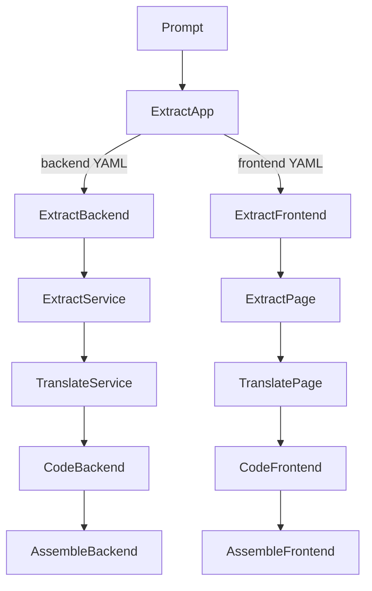

# Approche haut niveau (LCOD v2)

Objectif : partir du besoin utilisateur (prompt) et le transformer en code exécutable via une cascade de composés alignés avec la vision RAG.

## Étapes
1. **Intent utilisateur (`tooling/extract/app@0.1.0`)**
   - Entrée : prompt décrivant l'application souhaitée.
   - Sortie : YAML structuré séparant `backend` et `frontend` (services/pages, dépendances).
   - Implémentation : compose orchestrant une IA qui applique un gabarit et renvoie le YAML.

2. **Scission backend/frontend**
   - `tooling/extract/backend@0.1.0` et `tooling/extract/frontend@0.1.0` itèrent sur chaque service/page, produisent des blocs élémentaires documentés (description, inputs/outputs, services requis).

3. **Détail des services/pages**
   - Backend : `tooling/extract/service@0.1.0` mappe chaque service vers la base `RAG functions`. Réutilise si trouvé, sinon invente nom/description/paramètres et l’ajoute à la base.
   - Frontend : `tooling/extract/page@0.1.0` fait de même avec `RAG components` pour les structures UI.

4. **Transformation YAML → artefacts exécutables**
   - Backend : `tooling/translate/service@0.1.0` prépare des descripteurs/pipelines que les kernels peuvent interpréter (YAML enrichi, manifests, stubs) pour appeler directement les fonctions référencées.
   - Frontend : `tooling/translate/page@0.1.0` produit les descripteurs UI nécessaires pour que le kernel/frontend runner interprète les composants (avec génération de code optionnelle plus tard).

5. **Assemblage**
   - `tooling/assemble/backend@0.1.0` et `tooling/assemble/frontend@0.1.0` agrègent les artefacts générés dans un projet complet.

## Flux Mermaid

Les bases RAG sont au cœur du processus :
- `lookup` pour réutiliser des fonctions/composants existants.
- Ajout de nouveaux éléments lorsqu’un YAML en invente.

Un plan racine (`tooling/project/generate@0.1.0`) orchestrera l’ensemble, stockera les artefacts (YAML, code) et gérera la persistance.
