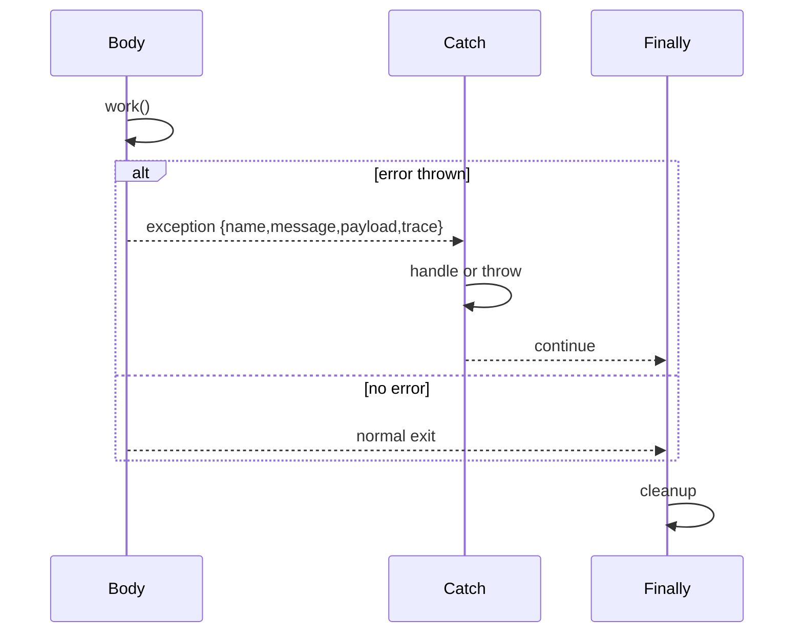

# Exception handling (LCOD v2)

## 1. Standard format
- Exception = `{ name, message, payload, trace }`.
- `trace`: stack of components/slots traversed (`[{ componentId, slot?, info }]`). The kernel updates it at every hop.

## 2. `throw` primitive
- Component `lcod://tooling/exception/throw@1`: takes `name`, `message`, `payload`, stops execution and bubbles up the exception.

## 3. `flow/try` (v2)
- Slots: `body`, `catch`, `finally`.
- Execution:
  1. Run `body`; if no exception → go to `finally`.
  2. If `body` throws:
     - `catch` receives the full object (`state.error` has `name/message/payload/trace`). It can handle or rethrow via `throw` (trace preserved).
     - `finally` always runs afterwards.
- If no `catch`, the exception bubbles immediately.

## 4. Propagation
- `runComponent` lets the error climb to the next `flow/try`. Without catch, it reaches the caller (parent compose, then CLI/host).
- Kernels may enrich metadata (stack trace) but must keep `{ name, message, payload, trace }` intact.

## 5. Helpers
- `tooling/exception/rethrow@1`: rethrow the received exception (useful in conditional catches).
- `tooling/exception/match@1`: match `name`/`payload` to route to different slots.

