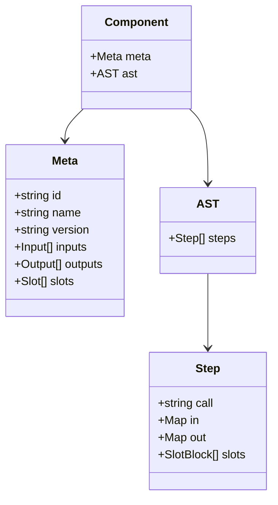

# Internal representation of an LCOD component

## 1. Metadata (`meta`)
- Identity: `id`, `name`, `version`, `namespace`, provenance (repo/commit/hash).
- Interfaces:
  - `inputs`: key → { jsonschema, required?, description, default }.
  - `outputs`: same structure.
  - `slots`: name → { description, local inputs/outputs, cardinality, optional? }.
- Documentation: summary, palette tags, README/diagram links.

## 2. Compose (`ast`)
- Ordered list of steps `{ call, in, out, slots }`.
- Each `call` references another component/contract/axiom; slots embed their own step lists (hierarchical AST).
- A slot shares the parent scope but can declare locals (`item`, `index`, etc.).
- Steps may carry annotations (debug labels, scope IDs) for introspection.

## 3. Special cases
- **Axioms**: only `meta` (no AST) because the implementation lives inside the kernel.
- **Inline components**: minimal `meta` + embedded AST (used for tests / registry scope).

## 4. Introspection
- Component `tooling/component/introspect@0.1.0` should return:
  - Full `meta`.
  - Normalized AST.
  - Dependency list (referenced components/contracts, depth, slots).
- Uses: autogenerated docs, Mermaid graphs, RAG insights, schema validation.

## 5. Canonical format
- JSON/YAML serialization `Component = { meta, ast }` (axiom ⇒ `ast = null`).
- Kernel-agnostic so resolver/testkit can inspect without loading code.
- Enables schema/README generation, graphs, diffing.

## 6. Next steps
1. Define the official JSON schema (`schemas/component.json`).
2. Implement `tooling/component/graph@0.1.0` to emit Mermaid from the AST.
3. Hook introspection into resolver/testkit.
4. Extend the RAG stores with `meta + ast` payloads.
