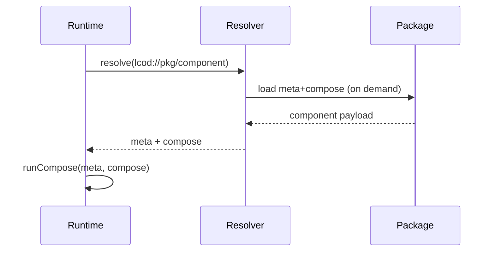
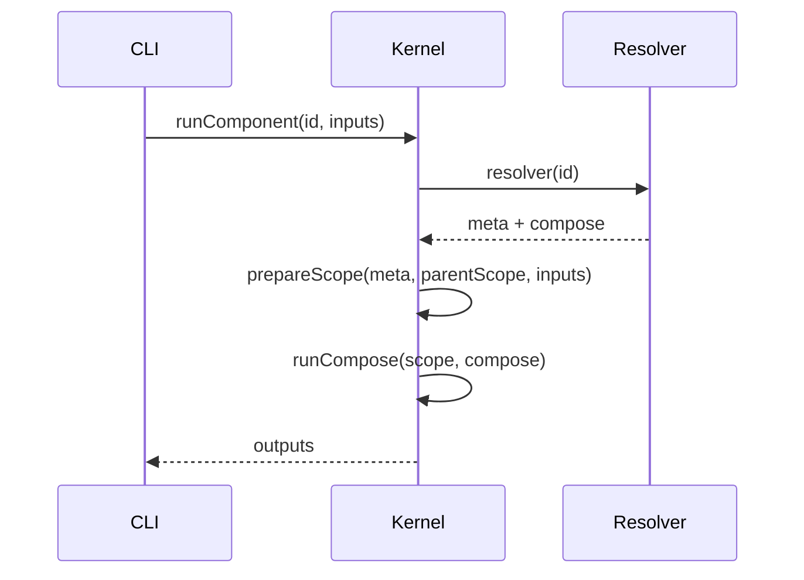

# High-level runtime functions (LCOD kernels)

## `runComponent(id, parentScope, inputState)`
1. `resolver(id)` → `{ meta, compose }` (or axiom stub).
2. `scope := prepareScope(meta, parentScope, inputState)` : hydrate inputs, init outputs/slots, attach logger/runtime info.
3. `runCompose(scope, compose)` (may call `runSlot`).
4. `return extractOutputs(scope, meta.outputs)`.

## `runCompose(scope, steps)`
- Iterate over AST steps.
- For each step:
  - Evaluate inputs (`evaluate(step.in, scope)`).
  - Call `runComponent(step.call, scope, inputs)` or run the axiom.
  - Apply outputs (`applyOut(scope, step.out)`).
  - Execute slots via `runSlot` when defined.
- Handles `flow/try`, `flow/foreach`, etc.

## `runSlot(slotName, slotDefinition, parentScope)`
- Create `slotScope` (inherits parent + locals like `item`, `index`, ...).
- Run `runCompose(slotScope, slotSteps)`.
- Copy back the keys defined in `slotDefinition.out` (parent decides what to collect).

## `prepareScope(meta, parentScope, inputState)`
- Validate/sanitize inputs using `meta.inputs`.
- Instantiate blank outputs, slot placeholders, and context objects (`logger`, `runtimeInfo`).
- Keep a pointer to `parentScope` for closure-style access.

## `extractOutputs(scope, outputsMeta)`
- Assemble the output object (apply defaults, drop undisclosed fields).

## `resolver(id)`
- Deterministic lookup (local → project → workspace → user → cache → registry).
- Returns `meta + compose` (or axiom/contract stub).
- Kernels ship with a bundled spec + resolver path so they can bootstrap themselves before honoring external lookup entries.
- Lookup entries reference *packages* (directories, archives, registries). They simply extend the search path. Components are loaded lazily: when a `call lcod://pkg/component` appears, the resolver walks the path, fetches `meta+compose` (disk/cache/registry), caches it, then hands it to the runtime.

## Associated helpers
- `runTry(scope, block)` : implements `try/catch/finally` using `{name,message,payload,trace}`.
- `runForeach(scope, items, slots)` : injects `item/index`, delegates to `runSlot`.
- `runBranch(scope, cond, slots)` : ergonomic helper for conditions with shared scope.
- `runInlineComponent(meta, compose, parentScope)` : executes inline components without resolver lookup.

