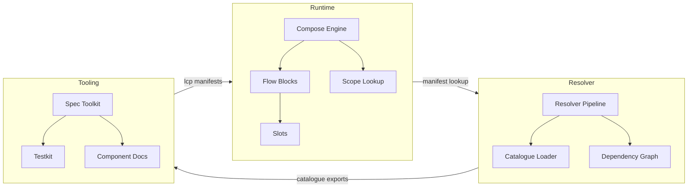

# LCOD v2 – System Overview

- **Runtime**: run-compose execution, slots/scopes, kernel bridges.
- **Resolver**: component lookup, manifests, dependency graph.
- **Tooling**: spec/testkit/doc generators feeding runtime/resolver.

Use the subsystem docs to dive deeper.
