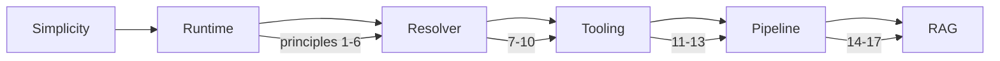

# LCOD principles (KISS edition)

1. **Component = readable black box.** `lcp.toml` defines inputs/outputs/slots; the compose fits on one screen.
2. **Compose = function.** Name steps for clarity but keep the “implement a function” mindset.
3. **Implicit only when obvious.** Spreads/destructuring allowed if intuitive; dependencies stay declared.
4. **Slots behave like lambdas with parent scope.** A compose creates its scope; slots inherit it and may tweak it.
5. **Factor fast.** When a pattern repeats, build a `tooling/*` helper instead of scripts.
6. **Minimal kernel (RPython-like).** Execution, slots, IO — nothing more. Logic lives in components/contracts.
7. **Deterministic lookup: local → project → workspace → user → cache → registry.** Public and stable order.
8. **Strict yet flexible sanitizer.** Only declared IO flows; parameters can be `any` when needed.
9. **Transparent resolver.** Same chain, clear warnings outside the happy path.
10. **Testkit recommended, not mandatory.** LCOD works without it, but each package should ship `tests/testkit/**` + a local plan.
11. **Single source docs.** README/diagrams generated from `lcp.toml`.
12. **Logging from day one.** `tooling/log` replaces ad-hoc console prints immediately.
13. **No useless copies.** Reuse instances; clone only for safety/parallelism.
14. **Exceptions beat heavy fallbacks.** Keep the happy path fluid; let errors bubble and handle them where it makes sense.
15. **Explicit scopes.** A compose starts with a fresh scope; sub-composes/slots keep references to the parent plus locals.
16. **Explicit exception handling.** `try/catch/finally` available everywhere using `{name,message,payload,trace}`.
17. **Always KISS.** Short modules, single responsibility, explicit composition.

