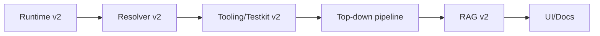

# LCOD v2 roadmap

## 1. Empty branches
- Create branches `spec-v2`, `kernel-rs-v2`, `kernel-js-v2`, `kernel-java-v2`, `resolver-v2`, etc. (minimal directories + tooling).
- Each branch starts from scratch (not from `main`). We reintroduce bricks progressively.

## 2. Priorities (build order)
1. **Minimal runtime**: `runComponent/runCompose/runSlot`, strict sanitizer, shared scope + exceptions.
2. **Resolver v2**: load `meta+compose`, deterministic lookup, local cache, introspection.
3. **Tooling v2**: introspection (`meta+ast`), graphs, minimal v2 testkit.
4. **Top-down pipeline**: `extract/*`, `translate/*`, `assemble/*` as in [`high-level-approach.md`](high-level-approach.md).
5. **RAG v2**: YAML/JSON storage for functions/components + lookup/insert APIs.
6. **UI/Docs**: Mermaid/UML generation for subsystems.

## 3. Subsystems to formalize
- **Runtime**: dedicated doc (sequence diagram) showing `runComponent → resolver → runCompose → runSlot → exceptions`.
- **Resolver**: sequence diagram (lookup local → workspace → registry, introspection, cache).
- **Tooling/Testkit**: Mermaid graphs for plans, `compose` slot, reporting.
- **Top-down pipeline**: refine with sequence/UML per step (`extract` → `translate` → `assemble`).
- **RAG**: entry schema, enrichment workflows.

## 4. Recommended diagrams
- Mermaid `flowchart` for flows, `sequenceDiagram` for kernel/resolver interactions, `classDiagram` for `meta+compose`.
- Each `docs/v2/*` entry should include a diagram and list the relevant contracts/components.

## 5. Implementation strategy
- Work branch by branch, add tests as soon as a brick is ready, reactivate checks progressively.
- Once branches are stable, merge into `main` (or switch `main` to this new base).

