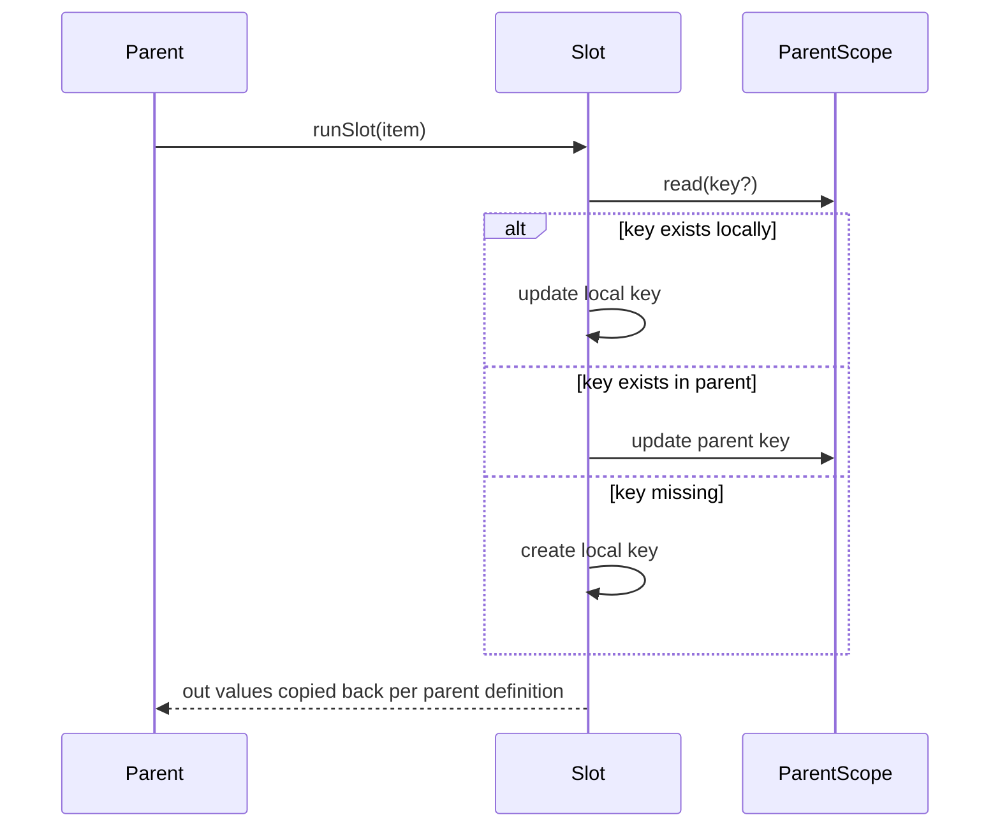

# Scope model (LCOD v2)

## 1. Compose vs slot
- **Sub-compose (`call`)**: receives only its `inputs`. It creates its own scope and cannot touch the parent (function semantics).
- **Slot**: receives a local scope plus a pointer to `parentScope`. It can read/write using the rules below.

## 2. Read / write semantics
- **Read**: look in the local scope first; if missing, walk up to the parent (closure behavior).
- **Write**:
  1. If the key exists locally → update local value (classic shadowing).
  2. Else if the key exists in parent → update the parent (direct mutation).
  3. Else → create the key locally.
  This avoids boilerplate while keeping the ability to mask values. **Any nested slot (A→B→C)** can update keys from the root scope as soon as those keys exist somewhere in the chain.
  New variables can still be created implicitly (no `var` required), though optional descriptors may be introduced later for tooling/linting.

## 3. Read-only slots
- Some slots (listeners, parallel work) can be flagged **read-only**: no parent mutations allowed.
- Modifiers: `writeParent: true|false`, `isolate: true|false` depending on execution constraints.

## 4. Propagation / `out`
- `out` belongs to the parent (the caller). It describes what the parent expects to retrieve from the slot (e.g. `removeIf` expects slot `predicate` to return `true/false`).
- Slots execute freely; once finished, the parent copies the declared values into its own scope and continues.
- Helpers (`tooling/value/branch`, `tooling/object/apply`) encapsulate this copy for author convenience.

### Example
```yaml
# A.yaml
var value = 3
call: lcod://array/remove_if@1
  in:
    list: $.numbers
  slots:
    predicate:
      - call: lcod://number/gt@1
        in:
          left: $.item
          right: $.value
        out:
          result: keep
```

```yaml
# remove_if compose
- call: lcod://flow/foreach@1
  in:
    items: $.list
  slots:
    body:
      - call: lcod://slot/run@1
        in:
          slot: "predicate"
          state:
            item: $.item
            index: $.index
        out:
          result: predicateResult
      - call: lcod://flow/if@1
        in:
          cond: $.predicateResult
        slots:
          then:
            - call: lcod://array/remove@1
              in:
                list: $.list
                index: $.index
```

## 5. Kernel implementation hints
- Each `scope` carries a pointer to its parent; getters/setters walk the chain when necessary.
- Mutations should be logged (handy for `tooling/log`, testkit, debugging).

## 6. Benefits
- Matches lambda mental model (closure + shadowing) → intuitive for low-coders/LLMs.
- Works for structural slots (layout, listeners) as well as algorithmic ones.


